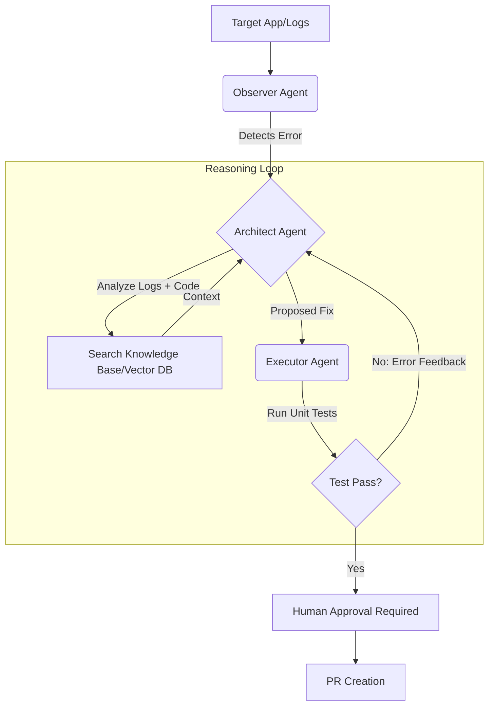

# Healix: Autonomous Self-Healing Infrastructure Agent

## Tech Stack

| Component | Tech Choice |
| --------- | ----------- |
| Language | Python 3.12+ / FastAPI |
| Orchestration | LangGraph (State Machine) |
| LLM | GPT-4o / Claude 3.5 Sonnet |
| Database | PostreSQL + pgvector |
| Monitoring | LangSmith (Tracing) |

## Engineering Decisions

### State Management: LangGraph vs. LangChain

- **Decision**: Use **LangGraph**
- **Rationale**: Traditional DevOps pipelines are linear. Agentic DevOps requires **cycles**. If a fix fails a unit test, then agent must "loop back" to the reasoning stage. LangGraph treats the workflow as a State Machine, allowing for robust error recovery and persistence.

### Communication Layer: Fast API + WebSockets

- **Decision**: **FastAPI** for the backend, **WebSockets** for the log stream.
- **Rationale**: Sometimes "Agent latency" is the biggest UX hurdle. By using WebSockets, we can stream the agent's "Chain of Thought" to the frontend in real-time, preventing the "black box" feel of long-running LLM calls.

### Memory & Context: Vector DB (Pinecode/pgvector)

- **Decision**: **pgvector** (PostgreSQL)
- **Rationale**: While Pinecone is execellent for managed scale, **pgvector (PostgreSQL)** allows us to keep the system's "Knwoledge Base" (vector) and "Transactional State" (agent history, human approvals) in a single ACID-compliant database. This reduces operational complexity and ensures data consistency during high-frequency healing ops.

### 🔒Security & Isolation

- **Containerized Execution**: All agent-proposed fixes and unit tests are executed within ephemeral **Docker** containers to prevent unauthorized system access.
- **Least Privilege**: The agent has read-only access to the main branch; all fixes are pushed to isolated `fix/*` branches for human audit.
